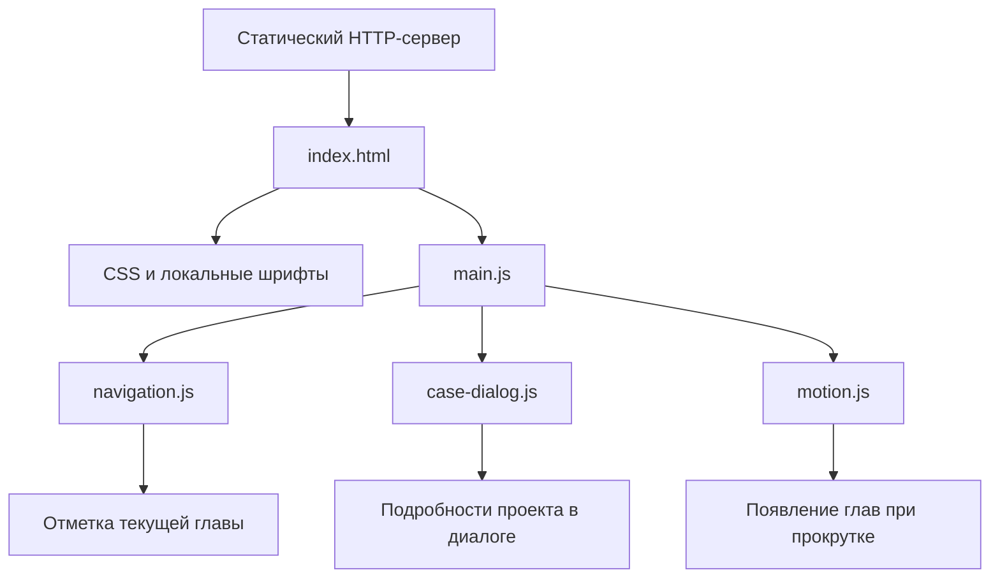

# Владимир Тарасенко — портфолио

Персональный сайт о профессиональном пути, продуктовой работе и AI-автоматизации. Одна страница объединяет историю карьеры, восемь проектов, описание подхода к работе и контакты.

Визуальная концепция — «Личный журнал»: крупная типографика, спокойный светлый фон, нумерация глав и кейсы в виде журнальных разворотов. Интерфейс поддерживает два способа знакомства: последовательное чтение истории и быстрый переход к конкретному проекту.

## Архитектура

Портфолио реализовано на HTML, CSS и JavaScript и размещается как набор статических файлов. HTTP-сервер отдаёт страницу, стили, шрифты и модули; вся интерактивная логика выполняется в браузере.

Архитектура разделена на три слоя:


| Слой       | Ответственность                                                              |
| ---------- | ---------------------------------------------------------------------------- |
| HTML       | Содержание, структура разделов, навигация и подробности проектов             |
| CSS        | Типографика, адаптивная композиция, состояния компонентов, анимация и печать |
| JavaScript | Определение текущей главы, открытие кейсов и появление разделов              |


Основной принцип — постепенное улучшение готовой страницы. Весь текст изначально находится в HTML. При отключённом JavaScript посетитель может читать историю, переходить по якорям, изучать подробности проектов и открывать контакты. Скрипты добавляют удобство к этой базовой версии.



Сборщик, клиентский фреймворк, серверное приложение и база данных не требуются. У сайта нет обращений к LLM, встроенной аналитики или загрузки проектов через GitHub API. Каталог обновляется вместе с HTML, а внешние ресурсы открываются обычными ссылками.

## Структура проекта

```text
portfolio/
├── index.html
├── styles/
│   ├── base.css
│   ├── layout.css
│   ├── components.css
│   ├── motion.css
│   ├── journal.css
│   └── print.css
├── scripts/
│   ├── main.js
│   ├── navigation.js
│   ├── case-dialog.js
│   └── motion.js
└── assets/
    ├── fonts/
    └── icons/
tests/
├── case-dialog.spec.js
├── layout.spec.js
├── navigation.spec.js
├── project-catalog.spec.js
├── reduced-motion.spec.js
└── static-fallback.spec.js
package.json
package-lock.json
playwright.config.js
```

Папка `portfolio/` содержит все необходимые для работы сайта файлы. `tests/` и npm-зависимости используются только при разработке и проверке.

## Содержание страницы

Страница состоит из шести разделов:


| Раздел          | Содержание                                                                                |
| --------------- | ----------------------------------------------------------------------------------------- |
| Первый экран    | Позиционирование, представление автора, ключевые результаты и переходы к истории и кейсам |
| История         | Шесть глав: ранний опыт, Кодология, УрФУ, Artsofte, Pressindex и ReStaff                  |
| Кейсы           | Восемь проектов с краткими описаниями и раскрывающимися подробностями                     |
| Подход          | Последовательность работы от изучения процесса до измерения эффекта                       |
| Следующая глава | Мотивация и направления профессионального интереса                                        |
| Контакты        | Telegram, email и GitHub                                                                  |


История показывает развитие компетенций и сохраняет параллельные линии опыта. Обучение и проектная работа не превращаются в искусственно последовательную цепочку мест работы.

В каталог входят три рабочих кейса — скрининг откликов в ReStaff, оценка агента разбора встреч в ReStaff и ускорение обработки медиаданных в Pressindex — и пять проектов из публичного GitHub-профиля: SocialBot, DemoAnalysis, SkinCheck AI, Telegram Claude Agent и AI Legal Docs.

Карточка даёт краткий ответ на вопрос, какую задачу решает проект. Подробности раскрывают решение, инструменты, результат и формат доступного материала. Технические демонстрации обозначены отдельно от рабочих результатов. Технологии, перечисленные внутри кейсов, относятся к соответствующим проектам, а не к стеку портфолио.

## Оформление и адаптивность

### Организация CSS

Стили подключаются последовательно, от общих правил к оформлению компонентов и отдельным режимам отображения:


| Файл                     | Назначение                                                                      |
| ------------------------ | ------------------------------------------------------------------------------- |
| `assets/fonts/fonts.css` | Подключение локальных гарнитур и диапазонов символов                            |
| `base.css`               | Исходные переменные, сброс браузерных стилей, базовая типографика и фокус       |
| `layout.css`             | Контейнер страницы, липкая шапка, сетка истории и якорные отступы               |
| `components.css`         | Кнопки, главы, результаты, карточки и модальный диалог                          |
| `motion.css`             | Появление элементов и обработка reduced motion                                  |
| `journal.css`            | Экранная тема «Личный журнал»: палитра, композиция и адаптивные переопределения |
| `print.css`              | Представление страницы при печати                                               |


&nbsp;